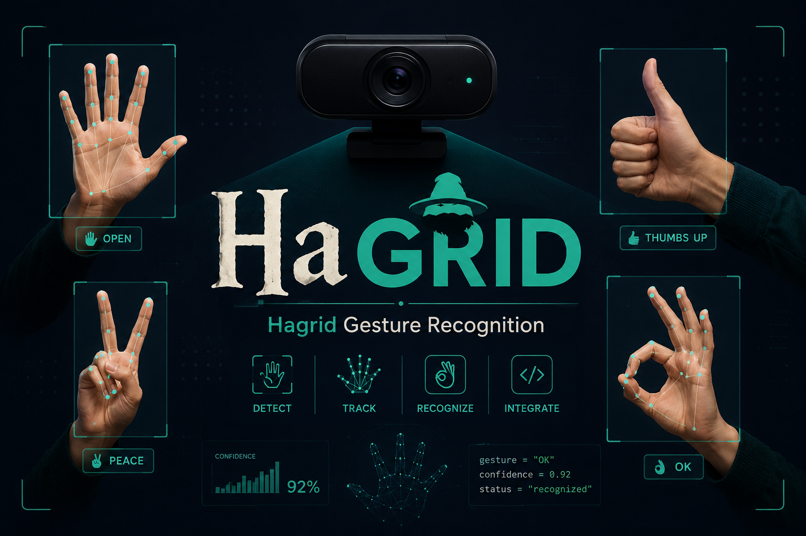
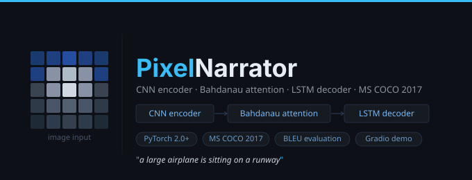
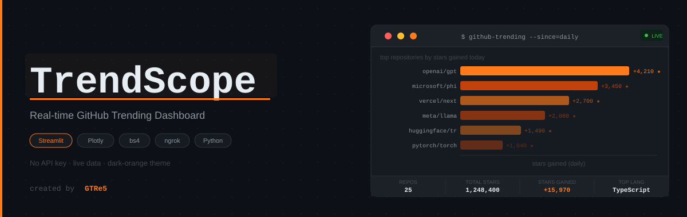
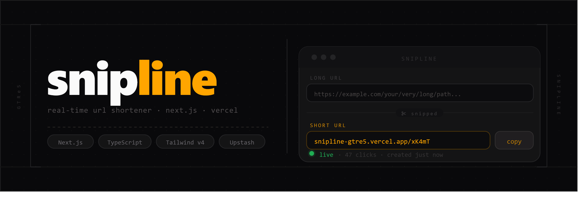

# 👋 Hi, I'm GTRe5

### Data Analyst · Machine Learning Engineer · Deep Learning Enthusiast

📍 Vietnam &nbsp;·&nbsp; 🎓 Ton Duc Thang University &nbsp;·&nbsp; 📫 hungpro123b@gmail.com

---

## 🧠 About Me

- 💡 Passionate about **Data**, **AI**, and building intelligent systems
- 🔍 Interested in: **NLP**, **Computer Vision**, **Recommendation Systems**
- 🚀 Goal: Become an **AI Engineer / Data Scientist**
- 🌱 Currently learning: MLOps, model deployment, LLM fine-tuning

---

## ⚡ Tech Stack

**Languages**

**Data & ML**

**Tools**

---

## 📂 Featured Projects

### 🤚 [HaGRID - Hand Gesture Recognition](https://github.com/GTRe5/hagrid-gesture-recognition)

📌 Real-time hand gesture classification from webcam using **EfficientNet-B0** fine-tuned on the HaGRID dataset (34 gesture classes).  
⚙️ Tech: PyTorch, timm, HuggingFace Datasets, OpenCV  
📊 Achievements:
- Fine-tuned EfficientNet-B0 with 2-phase freeze/unfreeze training strategy
- Achieved **97.8% validation accuracy** across 34 gesture classes
- Built a real-time webcam HUD demo with top-K predictions and FPS counter

---

### 🖼️ [PixelNarrator - AI Image Captioning (COCO)](https://github.com/GTRe5/Image-Captioning-COCO)

📌 End-to-end image captioning system combining **CNN + LSTM + Bahdanau Attention** - generates natural-language descriptions with per-word attention heat-maps.  
⚙️ Tech: PyTorch, ResNet-50, NLTK, Gradio  
📊 Achievements:
- Improved BLEU score with soft spatial Attention mechanism
- Benchmarked 4 ablation configs (baseline → pretrained encoder → attention → full model)
- Built interactive Gradio demo with clipboard paste and attention heat-map visualisation

---

### 📈 [TrendScope - Real-time GitHub Trending Dashboard](https://github.com/GTRe5/TrendScope)

📌 A live GitHub Trending dashboard that scrapes and visualises trending repositories in real time - **no API key required**. Features an interactive dark-orange themed UI with bar charts, daily star rankings, and KPI summaries.  
⚙️ Tech: Streamlit, Plotly, BeautifulSoup4, ngrok, Python  
📊 Achievements:
- Built a zero-auth scraper using **BeautifulSoup4** to pull live GitHub trending data without any API token
- Designed interactive **Plotly** bar charts ranking repositories by daily stars gained
- Exposed the local Streamlit app publicly via **ngrok** tunnel for easy live sharing
- Developed a custom dark-orange dashboard theme with a KPI strip (repos count, total stars, stars gained, top language)

---

### 🔗 [Snipline - Real-Time URL Shortener](https://github.com/GTRe5/Snipline)

📌 Real-time URL shortener built with **Next.js 16** (App Router) and **TypeScript** - paste a long link, get a short one back instantly, with custom aliases, live click tracking, and a full link ledger. Ready to deploy on **Vercel** in minutes.  
⚙️ Tech: Next.js 16, TypeScript, Tailwind CSS v4, Framer Motion, Upstash Redis  
📊 Achievements:
- Built short-code generation and click-tracked redirects entirely server-side with Next.js Server Components
- Implemented persistent storage via **Upstash Redis**, with an automatic in-memory fallback for local dev
- Added custom aliases, per-IP rate limiting, and a collision-safe **nanoid**-based code generator
- Engineered a real-time link ledger with live click-count polling and **Framer Motion** animations

---

## 📊 GitHub Analytics

<!-- Streak + total contributions (demolab - very stable) -->

<!-- Profile Summary Cards - languages by repo count + most committed language -->
|  |  |
| --- | --- |

<!-- Full profile overview card -->

<!-- Trophies -->

---

## 🏆 Highlights

- 🤚 Real-time gesture recognition with **97.8% val accuracy** (34 classes, EfficientNet-B0)
- 🖼️ End-to-end image captioning pipeline on **COCO** with Attention mechanism
- 📦 Big data processing with **PySpark + Hadoop** on market basket datasets
- 🔬 Hands-on experience with **COCO**, **HaGRID**, **DAQUAR**, and custom datasets

---

⭐️ From **GTRe5** - Building AI for the future 🚀

